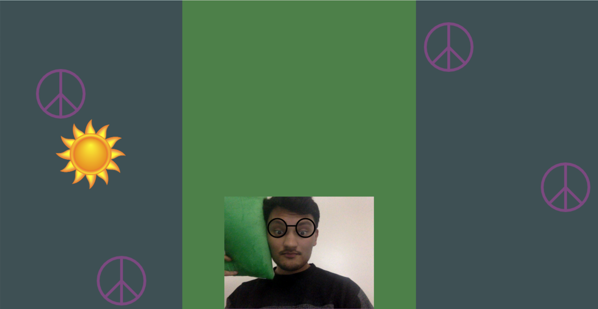
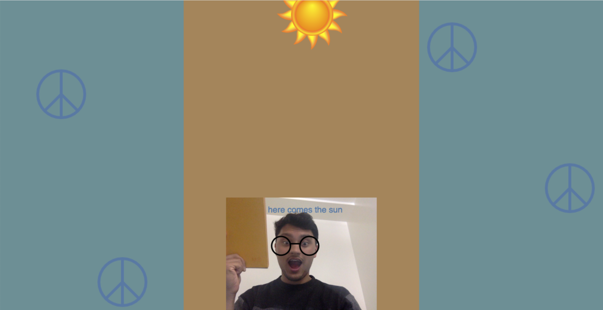
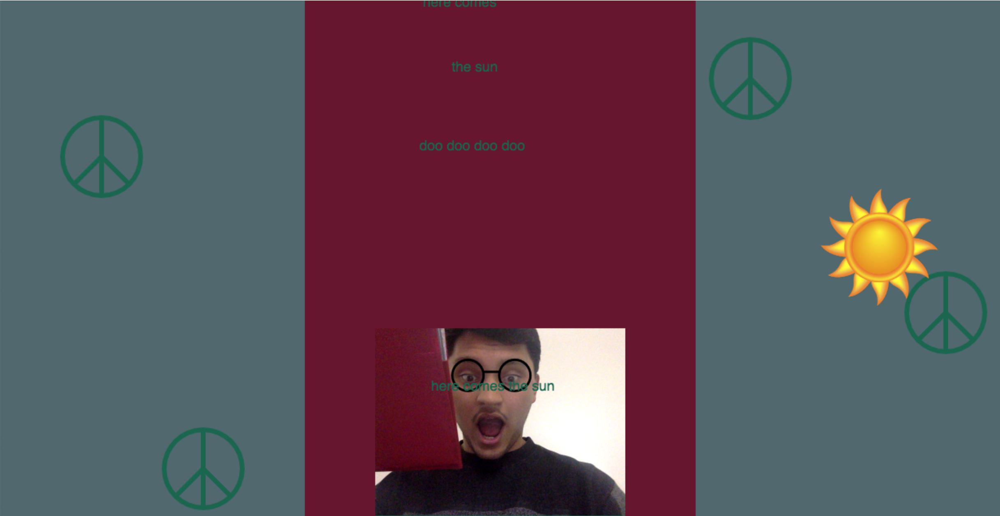
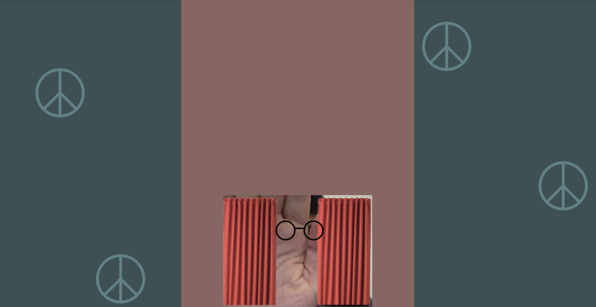

## Here Comes the Sun:  Connected-Sketch with p5js, FaceOSC

Note: Requires download and Node.js server in backend to run in conjunction with FaceOSC application.

Enjoy interacting with the Beatles' famous song using your face and the environment around you!

## <u>Features</u>

##### Color tracking, mouth tracking and eyebrow tracking

- Raising eyebrows will cause the sun to rise across the screen.
- Center tab color sampled from your environment through the webcam.
- Peace signs and lyrics text stand in contrast, as the complementary color.
- Retro glasses track your eyes.
- As you open your mouth, the song plays and lyrics float from your tracked mouth.
- As the song progresses, the "nighttime" background becomes lighter as the sun rises, and eventually becomes blue.
- If you obscure your face, or move away from the webcam, the curtains will close on your performance.

## <u>Screenshots</u>:

## <u>Credits:</u>

https://github.com/genekogan/p5js-osc

"Here Comes the Sun" - Beatles